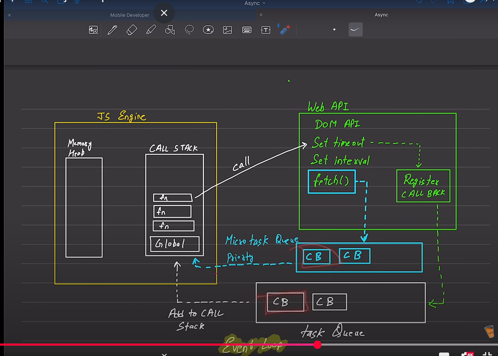
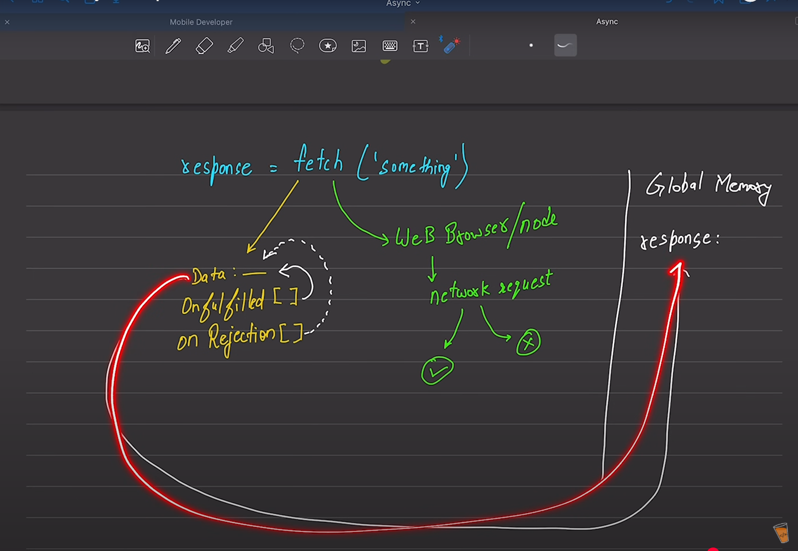

# 📘 JavaScript Promises – Rapid Interview Revision

## 🔹 What is a Promise?
A **Promise** is an object in JavaScript that represents the eventual completion (or failure) of an asynchronous operation and its resulting value.

### 🔸 Why use Promises?
- Handle asynchronous operations (like API calls, DB fetch, file read)
- Avoid "callback hell"
- Clean, readable async code

```js
const promise = new Promise((resolve, reject) => {
  // async code
});
```

## 🔸 States of Promise
1. **Pending** – Initial state, neither fulfilled nor rejected.
2. **Fulfilled** – Operation completed successfully.
3. **Rejected** – Operation failed.

---

## 🔹 Consuming Promises

### ✅ Using `.then()` and `.catch()`
```js
promise
  .then((result) => { /* handle success */ })
  .catch((error) => { /* handle error */ })
  .finally(() => { /* always runs */ });
```

### ✅ Using `async/await`
```js
async function fetchData() {
  try {
    const result = await promise;
  } catch (error) {
    console.log(error);
  }
}
```

---

## 🔹 Examples

### 🔸 Basic Promise
```js
const promiseOne = new Promise((resolve, reject) => {
  setTimeout(() => {
    resolve();
  }, 1000);
});

promiseOne.then(() => {
  console.log("Promise consumed");
});
```

### 🔸 Direct Promise
```js
new Promise((resolve) => {
  setTimeout(() => {
    resolve();
  }, 1000);
}).then(() => console.log("Resolved"));
```

### 🔸 Promise with Data
```js
const promiseThree = new Promise((resolve) => {
  resolve({ username: "chai", email: "chai@example.com" });
});

promiseThree.then((user) => console.log(user));
```

### 🔸 Promise with Error Handling
```js
const promiseFour = new Promise((resolve, reject) => {
  const error = true;
  if (!error) {
    resolve({ username: "hitesh" });
  } else {
    reject("Something went wrong");
  }
});

promiseFour
  .then((user) => user.username)
  .then((username) => console.log(username))
  .catch((err) => console.log(err))
  .finally(() => console.log("Done"));
```

### 🔸 Using `async/await`
```js
const promiseFive = new Promise((resolve, reject) => {
  const error = false;
  if (!error) {
    resolve({ username: "javascript" });
  } else {
    reject("JS error");
  }
});

async function consumePromise() {
  try {
    const result = await promiseFive;
    console.log(result);
  } catch (err) {
    console.log(err);
  }
}
consumePromise();
```

---

## 🔹 Bonus: Fetch API with Promises
```js
fetch('https://jsonplaceholder.typicode.com/users')
  .then((res) => res.json())
  .then((data) => console.log(data))
  .catch((err) => console.log("Error:", err));
```

---

## 🔸 Quick Summary

| Concept          | Method      |
|------------------|-------------|
| Create Promise   | `new Promise()` |
| Handle success   | `.then()`   |
| Handle error     | `.catch()`  |
| Always run       | `.finally()`|
| Wait for result  | `await`     |
| Use `await` in   | `async` function only |

---

### ✅ Tips:
- Always use `.catch()` or `try-catch` to avoid unhandled rejections.
- Use `finally()` for cleanup (like loading spinners etc).
- `await` can make code look synchronous (clean & readable).

### images

